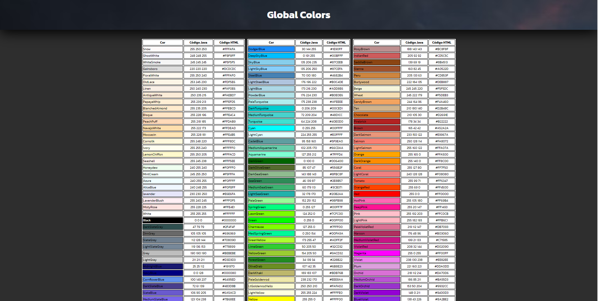
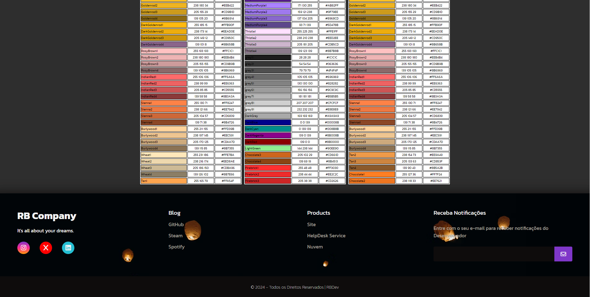

<h1>Página de Cores</h1>

Olá Devs 

Este é um pequeno demonstrativo de códigos de cores em CSS e JavaScript; O ponto chave mesmo seria apenas de deixar minhas informações somente no footer da página com Instagram/GitHub/LInkedin e alguns dos meus projetos principais fixados na aba de *Products*.

- RBDev (Rocca & Biel Company.)

<h2>Projeto publicando no Vercel:</h2>
- link: https://global-colors.vercel.app/
